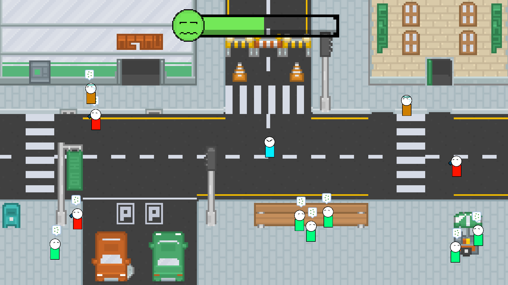

I've worn many hats in my time at DigiPen Singapore, usually always at a Producer/Project Manager role, where I'm able to oversee an entire project at once.  

This page lists all notable projects I've worked on, ranging from multi-disciplined student games to solo game jams. I've worked with Unreal Engine 4, Unity, Godot as well as custom C++ engines created as part of student projects.  

---
---

<!---->
<iframe width="720" height="405" src="https://www.youtube.com/embed/oB_Zaoc2pgY" frameborder="0" allow="accelerometer; autoplay; encrypted-media; gyroscope; picture-in-picture" allowfullscreen></iframe>

## **Kindred**

**Producer, Editor Programmer, Gameplay Designer/Programmer and Cinematics Designer**  
September 2019 - June 2020  
Custom Engine (C++ / C#)  
Team Size: 11

Kindred is a 3D narrative platformer where players relive old memories as Father and Son. Playing as each character, they journey through old and warped memories and relive moments of their lives with one another.

**Responsibilities**  
My main contributions to this project were as a Producer and a Programmer/Designer.  

Production-wise I managed a team of 11: 3 artists, 6 programmers and 2 designers. It was a bigger team than I had previously managed and I had to quickly learn how to delegate tasks and responsibilities to the leads rather than tracking them myself.

I followed an *Agile and Scrum* management style, with weekly team meetings to discuss progress, prioritise upcoming tasks and generally as a sync-up point so the team was aware of the project's progress. I also integrated a *Kanban* approach to breaking down and viewing the various tasks of the different departments via Trello.

With a large team, I sought to setup pipelines between each departments, linking them to members of importance in other departments. For example, I worked with the Technical Lead/Scripting Programmer to setup a bug reporting system when the Design team would encounter issues with scripting behaviours.

I also ensured that each milestone's submission was of high quality and as bug-free as possible, QA testing the project at every submission.

On the Programming side, I worked on
- Level editor, created with ImGui and had features like
  - Drag and drop for asset swapping
  - Undo/Redo manager
  - Nested tree view of the scene

On the Design side, I worked on
- Scripting gameplay mechanics
- Creating a dialogue and cinematics system
- Assisting with level design
- Designing all cutscenes

I also helped to edit and provide feedback for the in-game dialogue and audio.

<!--Learn more about the details of my responsibilities [here]()!-->
Check it out [here!](https://games.digipen.edu/games/kindred){:target="_blank"}

---

<!---->
<iframe width="720" height="405" src="https://www.youtube.com/embed/-3gB86JMQ-8" frameborder="0" allow="accelerometer; autoplay; encrypted-media; gyroscope; picture-in-picture" allowfullscreen></iframe>

## **Mega Macho Brothers**

**Producer, Engine Programmer and Editor Programmer**  
September 2018 - April 2019  
Custom Engine (C++)  
Team Size: 7  

Mega Macho Brothers is a 2D co-op action platformer where players take on the roles of Marko and Pedro as they fight off an alien invasion. Players can grab and throw their "Brothers" while defending the city from invading aliens.

**Responsibilities**  
This was my 1st major project as a Producer and Programmer.

I managed a team of 7 members: 1 artist, 4 programmers and 2 designers. It was the first time I formally worked on a project as a Producer and while I learnt about about good practices, I also made a lot of mistakes along the way.

Initially, meetings were carried out in a "semi" *Agile* style, with entire team meetings only happening when a major feature/milestone was completed and I needed everyone's feedback on the next milestone. Once I realised that progress was difficult to track, I enforced weekly meetings that also served to keep members updated on progress of each department.

HacknPlan was also used to help visualise the progress of features and bugs, helping tremendously in assessing how the project was progressing.

On the Programming side, I worked on
- Entity manager
- Serialization
- Audio system
- Level editor, created in ImGui and had features like
    - Drag and drop for asset swapping
    - Nested tree view of the scene
    - AI editor interface for modifying enemy AI
- Gameplay mechanics

I also helped with gathering and providing feedback for gameplay and level design.

Mega Macho Brothers was awarded *Unity Best Sophomore Game* at the DigiPen Game Awards 2019!

<!--Learn more about my responsibilities [here]()!-->
Check it out [here!](https://games.digipen.edu/games/mega-macho-bros){:target="_blank"}

---

## **Go Home!**

**Solo Developer and Artist**  
April 2019  
Unity  
Team Size: Solo  

Go Home! is a game developed for Ludum Dare 46 - Theme: "Keep It Alive".  
It was developed over 1 weekend as part of the Ludum Dare game jam.  

Players take the role of a guy who's had too much of people breaking the pandemic lock-down and spreading the infection.  
Get them to stay home the only way you know how.  
By yelling in their faces until their comply!

Check it out [here!](https://acjh13.itch.io/go-home){:target="_blank"}
