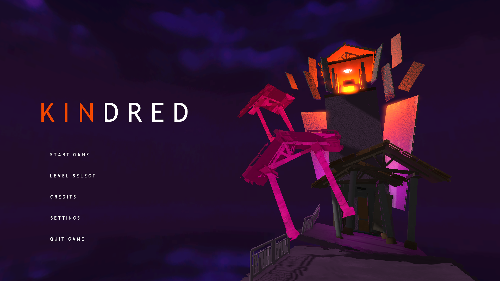
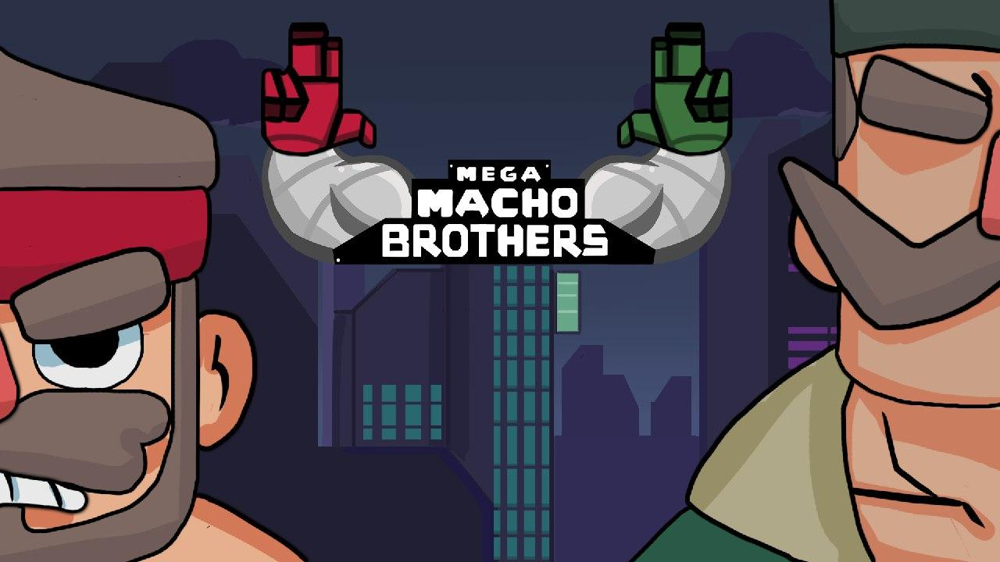

I've worn many hats in my time at DigiPen Singapore, usually always at a Producer/Project Manager role, where I'm able to oversee an entire project at once.  

This page lists all notable projects I've worked on, ranging from multi-disciplined student games to solo game jams. I've worked with Unreal Engine 4, Unity, Godot as well as custom C++ engines created as part of student projects.  

---
---

<!---->
<iframe width="720" height="405" src="https://www.youtube.com/embed/oB_Zaoc2pgY" frameborder="0" allow="accelerometer; autoplay; encrypted-media; gyroscope; picture-in-picture" allowfullscreen></iframe>

## **Kindred**

**Producer, Editor Programmer, Gameplay Designer/Programmer and Cinematics Designer**  
September 2019 - June 2020  
Custom Engine (C++)  
Team Size: 11

Kindred is a 3D narrative platformer where players relive old memories as Father and Son.

- Led and organized weekly team meetings.
- Implemented major editor features, including an Undo/Redo system (C++).
- Ensured project milestones were met while maintaining quality and integrity.
- Scheduled and prioritised tasks for team members.  

<!--Learn more about the details of my responsibilities [here]()!-->
Check it out [here!](https://games.digipen.edu/games/kindred){:target="_blank"}

---

<!---->
<iframe width="720" height="405" src="https://www.youtube.com/embed/-3gB86JMQ-8" frameborder="0" allow="accelerometer; autoplay; encrypted-media; gyroscope; picture-in-picture" allowfullscreen></iframe>

## **Mega Macho Brothers**

**Producer, Engine Programmer and Editor Programmer**  
September 2018 - April 2019  
Custom Engine (C++)  
Team Size: 7  

Mega Macho Brothers is a 2D co-op action platformer where players take on the roles of Marko and Pedro as they fight off an alien invasion.

- Led and organized weekly team meetings.
- Worked with lecturers to discuss project priorities.
- Cut and re-prioritised non-essential game mechanics and features to prevent scope creep.

<!--Learn more about my responsibilities [here]()!-->
Check it out [here!](https://games.digipen.edu/games/mega-macho-bros){:target="_blank"}

---

## **Go Home!**

**Solo Developer and Artist**  
April 2019  
Unity  
Team Size: Solo  

Go Home! is a game developed for Ludum Dare 46 - Theme: "Keep It Alive".  
It was developed over 1 weekend as part of the Ludum Dare game jam.  

Players take the role of a guy who's had too much of people breaking the pandemic lock-down and spreading the infection.  
Get them to stay home the only way you know how.  
By yelling in their faces until their comply!

Check it out [here!](https://acjh13.itch.io/go-home){:target="_blank"}
